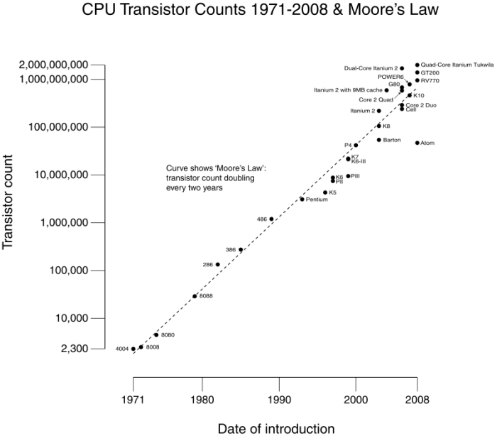

# [Inon Sharony](#top)

## @ Tel Aviv University

Click section titles to jump back to top of page.

## <a name="contact">Contact</a>

e-mail: [InonShar (at) TAU (dot ) ac (dot) IL](emailqrcodeinonshar.png) (click for QR code)  
Web site: [QR code](siteqrcodeinonshar.png)  
Address: School of Chemistry, Raymond and Beverly Sackler Faculty of Exact Sciences,  
Tel Aviv University, 60 Levanon Street, Ramat Aviv 69978, Israel  
Office: Ornstein 411A  
Phone: +972-3-640-7634  

## [Introduction](#top)

My name is Inon Sharony, and I am a doctoral student in Professor Avraham [Nitzan](http://atto.tau.ac.il/~nitzan/nitzan.html)'s group at [TAU](http://www.tau.ac.il).  
I graduated my B.Sc. studies in 2007, majoring in Chemistry with Physics as a minor subject.  
My particular area of interest within our group is heat conduction through molecular wires.  

CV:  

## [Molecular Electronics](#top)

Click here for an animation of a [Single Molecule of Thioethane Adsorbed on a Single Atom of Gold (tethered to its place) relaxing to zero Kelvin from room temperature](eq.gif)  

  

This is a schematic of a molecular junction of the type our group deals with. We study transport through the molecular bridge between two contacts. The transport may be of an electrical current or of heat, for example. In the instance shown above, the molecular junction operates as an electronic switch (M. Reed, et al., Science 1999).  

  
Cartoon of a simulated Metal-Molecule-Metal (MMM) junction of the simplest kind -- in this case a Hydrogen molecule.  

  
Professor J. C. Cuevas at the Cond. Mat. Theo. Phys. department of the Universidad Autonoma de Madrid has uploaded a presentation he gave in which I found this slide depicting the functional character of some molecular electronics. (The original isn't mine. Please excuse the typographical error.)  

## [Motivation](#top)

Rolf Landauer, ["Irreversibility and Heat Generation in the Computing Process,"](http://dx.doi.org/10.1147/rd.53.0183) IBM Journal of Research & Developement, vol. 5, pp. 183-191, 1961\.  

Gordon Moore, ["Cramming more components onto integrated circuits,"](ftp://download.intel.com/museum/Moores_Law/Articles-Press_Releases/Gordon_Moore_1965_Article.pdf) Electronics, Volume 38, Number 8, April 19, 1965\.  

  
Victor V. Zhirnov, Ralph K. Cavin, III, James A. Hutchby, and George I. Bourianoff, ["Limits to Binary Logic Switch Scaling -- A Gedanken Model,"](http://ieeexplore.ieee.org/stamp/stamp.jsp?arnumber=01240081) Proceedings of the IEEE, Vol. 91, No. 11, November 2003\.  

Arieh Aviram & Mark A. Ratner, ["Molecular Rectifiers,"](http://dx.doi.org/10.1016/0009-2614(74)85031-1) Chemical Physics Letters, vol. 29, no. 2, pp. 277-283, November 15, 1974.  

## [Experiments](#top)

  

*   "All science is either physics or stamp collecting." -- Ernest Rutherford, 1st Baron of Nelson (father of nuclear physics) quoted in "Rutherford at Manchester" (1962) by J. B. Birks.
*   "If your experiment needs statistics, you ought to have done a better experiment." -- also attributed to Rutherford.
*   "Experimental confirmation of a prediction is merely a measurement. An experiment disproving a prediction is a discovery." -- attributed to Enrico Fermi.

  
Scanning electron micrograph of an electromigration-fabricated gold junction, with a nanometre-scale gap, used by Stephanie Getty and co-workers at the University of Maryland, USA, to study transport through single molecules.  
"Molecular electronics: Back under control", Mark A. Reed, Nature Materials 3, 286 - 287 (2004).  

  
A neat way of creating a nano- junction by bridging the gap between the electrodes, and then pulling them apart, thereby creating the nanoscale bridge.  

  
STM image at 63 K of trans-BCTBPP wires formed on the Au(111) surface (imaged area 70 x 70 nm).  
"Selective assembly on a surface of supramolecular aggregates with controlled size and shape", Yokoyama et. al., Nature 413, 619-621 (2001).  

## [Teaching](#top)

*   "In mathematics you don't understand things. You just get used to them." -- John von Neumann, quoted in "The Dancing Wu Li Masters" (1984) by Gary Zukav.
*   "Mathematics is the only good metaphysics." -- William Thomson, 1st Baron of Kelvin, quoted in E. T. Bell, Men of Mathematics, xvii.
*   Math books are studied by physicists for the same reason the lawbook is studied by criminals. -- paraphrasing Professor Roman Mints.
*   "There is no rigorous definition of rigor." -- Morris Kline, "Mathematics: The Loss of Certainty," p. 315, (1982).

In spring semesters since 2009, I was the lead lab instructor for the [Computational Chemistry Laboratory](http://www.tau.ac.il/~ephraim/complab.html), under Associate Professor Ephraim Eliav.  
My responsibilities included delivering frontal lectures to the entire class, leading interactive teaching sessions, instructing lab groups (as well as grading their preparatory exercises and final reports), personally evaluating students within my lab group, developing lab exercises, maintaining the lab manual, and composing and grading quiz questions.  
Since I began instructing in the lab, we have had multiple requests by research group heads and their students from other universities to have students enroll in our course, as they have found it uniquely adapted to their research needs.  
Additionally, student demand had outrun lab accommodations three years in a row.  
During the time in which I have been an instructor in the Computational Chemistry Lab, I've learned a great deal, both with regard to the management and leadership of an instruction team, and with regard to the course material itself.  
I've tried to put an emphasis on the specific research interests of the students, and on how the Computational Chemistry Lab can give them the necessary tools for these applications.  

*   "In your letter you apply the word _imponderable_ to a molecule. Don't do that again." -- James Clerk Maxwell FRS FRSE in a September 1874 letter to Lewis Campbell, quoted in Lewis Campbell and William Garnett, "The Life of James Clerk Maxwell," p. 391 (1882).  

    In fall semesters since 2009, I was the senior recitation master for the course [Thermodynamics](http://www.tau.ac.il/~hdiamant/teaching//2011/thermo/), under Professor Haim Diamant.  
    As such, my responsibilities included delivering weekly two-hour frontal lectures, personally tutoring students, synchronizing the recitations with the Professor's lectures, maintaining the existing TA guide and producing new modules, and assisting the Professor with the preparation and administration of the final exam.  
    The relatively long time during which I've held this position has afforded me the opportunity to acquire and hone my teaching skills, as well as improving my fundamental understanding of the course material and related topics.  

    In the 2013 spring semester I was the instrutor of the [Molecular Dynamics computer experiment](http://www.tau.ac.il/~physchem/Dynamics) at the Advanced Laboratory in Physical Chemistry.  
    I recieved the experiment in a decrepid condition -- it was not revamped since its inception in 2001\. Building on my past teaching experience, I gathered all the relevant material I could find and consolidated a new laboratory manual. The experiment was bolstered by adding new modules which give the students their first experience in applying such varied methodologies as mathematical modeling, random processes, probability & statistics, numerical methods (e.g. for differentiation & integration), statistical mechanics, and computational chemistry.  

    ## [Other](#top)

      
    Manifestations of the different parts of the stress tensor in earthquakes.  

      
    Superquadric tensor glyphs can be used to conveniently visualize any symmetric 3D second-order tensor (i.e. symmetric 3D matrix), [as suggested by Kindlmann](http://www.cs.utah.edu/~gk/papers/vissym04/). I was first introduced to the concept of tensor ellipsoids by [Prof. Lev Vaidman](http://en.wikipedia.org/wiki/Lev_Vaidman) while taking [his course on Analytical Mechanics](http://www.tau.ac.il/~quantum/Vaidman/AM.html), in which he used such glyphs to depict the angular inertia tensor. See also the discussion of the dielectric tensor in Landau & Lifshitz's "Theory of Elasticity".  

      
    Physicists are very clever people. When they want to find out what something is made of, they take two of the thing and crash them together, much as a toddler would two toy trucks. When pieces fly off, they look at what originally consisted the particles they collided. The Mass-Energy equivalence shows up in particle accelerators much as this drawing depicts -- the kinetic energy that the original particles were endowed allows for particles heavier than the originals to be created, while the products carry less momentum.  

    And God said...  
      
    The d'Alembert formula (the four-dimensional wave equation in shorthand tensor notation) in a vacuum.  

    *   "In science, if you know what you are doing you should not be doing it.  
        In engineering, if you do not know what you are doing you should not be doing it.  
        Of course, you seldom, if ever, see the pure state." -- Richard Hamming, "The Art of Doing Science and Engineering: Learning to Learn," p. 5, (1997).
    *   "Science is the belief in the ignorance of experts." -- Richard Feynman in the address "What is Science?", presented at the fifteenth annual meeting of the National Science Teachers Association, in New York City (1966), published in The Physics Teacher, volume 7, issue 6 (1969), p. 313-320.
    *   “Research is the process of going up alleys to see if they are blind.” -- Marston Bates, "The Nature Of Natural History."  
      

    A wonderful Hetzsprung-Russell diagram which depicts the relation between mass, luminosity, and temperature of different known populations of stars.  

      

    A statue erected in honor of Sir Arthur Conan Doyle in Edinburgh, featuring the quintessential man of pure reason.  

    *   "Linda is 31 years old, single, outspoken, and very bright. She majored in philosophy. As a student, she was deeply concerned with issues of discrimination and social justice, and also participated in anti-nuclear demonstrations.  

        Which is more probable?

        1.  Linda is a bank teller.
        2.  Linda is a bank teller and is active in the feminist movement."

        The conjunction fallacy. Tversky, A. and Kahneman, D. (1982) "Judgments of and by representativeness". In D. Kahneman, P. Slovic & A. Tversky (Eds.), Judgment under uncertainty: Heuristics and biases. Cambridge, UK: Cambridge University Press.  

    *   When evedince starts presenting itself that you may be the smartest person in the room, is when you should start asking yourself if you're in the right room.  

    *   Presonal branding isn't about how you present yourself, but how you are represented to others.v  

    *   "An error doesn't become a mistake until you refuse to correct it." attributed to Orlando Aloysius Battista  

    *   "History teaches us that men and nations behave wisely once they have exhausted all other alternatives." -- Abba Even, speech given in London on December 16th, 1970 (quoted in the London Times the next day).  

    *   "We’d all like t’vote fer th’best man, but he’s never a candidate". -- Frank McKinney Hubbard, "The Best of 'Kin' Hubbard" (1984).  

    *   Leadership, a colloquial definition:  
        Motivating others to do better in your presence, and making the effect last in your absence.  

        "עוד לא נולד המגאפון שישמעו אותו בתוך ישיבת הממשלה" -- שר האוצר, י. לפיד.

    *   "In this world nothing can be said to be certain, except death and taxes." -- Benjamin Franklin, in a letter to Jean-Baptiste Leroy (13 November 1789)  

    *   Omnia dicta fortiora si dicta Latina  
      

    *   "The reasonable man adapts himself to the world: the unreasonable one persists in trying to adapt the world to himself. Therefore all progress depends on the unreasonable man." -- George Bernard Shaw, "Maxims for Revolutionists", #124, (1903).  
      

    *   "Israel is the largest American aircraft carrier in the world, that cannot be sunk, does not carry even one American soldier, and is located in a critical region for American national security." -- Attributed to General Alexander Meigs Haig, Jr., U.S. Secretary of State

    אני מאמין / שאול טשרניחובסקי (1894)  

    שַׂחֲקִי, שַׂחֲקִי עַל הַחֲלוֹמוֹת,  
    זוּ אֲנִי הַחוֹלֵם שָׂח.  
    שַׂחֲקִי כִּי בָאָדָם אַאֲמִין,  
    כִּי עוֹדֶנִּי מַאֲמִין בָּךְ.  

    כִּי עוֹד נַפְשִׁי דְרוֹר שׁוֹאֶפֶת,  
    לֹא מְכַרְתִּיהָ לְעֵגֶל-פָּז,  
    כִּי עוֹד אַאֲמִין גַּם בָּאָדָם,  
    גַּם בְּרוּחוֹ, רוּחַ עָז.  

    רוּחוֹ יַשְׁלִיךְ כַּבְלֵי-הֶבֶל,  
    יְרוֹמְמֶנּוּ בָּמֳתֵי-עָל;  
    לֹא בָּרָעָב יָמוּת עוֹבֵד,  
    דְּרוֹר – לַנֶּפֶשׁ, פַּת – לַדַּל.  

    שַׂחֲקִי כִּי גַּם בְּרֵעוּת אַאֲמִין,  
    אַאֲמִין כִּי עוֹד אֶמְצָא לֵב,  
    לֵב – תִּקְווֹתַי גַּם תִּקְווֹתָיו,  
    יָחוּשׁ אֹשֶׁר, יָבִין כְּאֵב.  

    אַאֲמִינָה גַּם בֶּעָתִיד,  
    אַף אִם יִרְחַק זֶה הַיוֹם,  
    אַךְ בּוֹא יָבוֹא – יִשְּׂאוּ שָׁלוֹם  
    אָז וּבְרָכָה לְאֹם מִלְּאֹם.  

    יָשׁוּב יִפְרַח אָז גַּם עַמִּי,  
    וּבָאָרֶץ יָקוּם דּוֹר,  
    בַּרְזֶל-כְּבָלָיו יוּסַר מֶנּוּ,  
    עַיִן-בְּעַיִן יִרְאֶה אוֹר.  

    יִחְיֶה, יֶאֱהַב, יִפְעַל, יַעַשׂ,  
    דּוֹר בָּאָרֶץ אָמְנָם חָי,  
    לֹא בֶּעָתִיד, בַּשָּׁמַיִם –  
    חַיֵּי-רוּחַ לוֹ אֵין דָּי.  

    אָז שִׁיר חָדָשׁ יָשִׁיר מְשׁוֹרֵר,  
    לְיֹפִי וְנִשְׂגָּב לִבּוֹ עֵר;  
    לוֹ, לַצָּעִיר, מֵעַל קִבְרִי  
    פְּרָחִים יִלְקְטוּ לַזֵּר.  

      

    [Back to top](#top)

Sections:

*   [Contact](http://atto.tau.ac.il/~inonshar/#contact)
*   [Intoduction](http://atto.tau.ac.il/~inonshar/#intro)
*   [Molecular Electronics](http://atto.tau.ac.il/~inonshar/#MolecularElectronics)
*   [Motivation](http://atto.tau.ac.il/~inonshar/#motiv)
*   [Experiments](http://atto.tau.ac.il/~inonshar/#exp)
*   [Teaching](http://atto.tau.ac.il/~inonshar/#teach)
*   [Other](http://atto.tau.ac.il/~inonshar/#other)

Links:

*   [Home](http://atto.tau.ac.il/~inonshar)
*   [Professor Nitzan](http://atto.tau.ac.il/~nitzan/)
*   [Nitzan's group](http://atto.tau.ac.il/~nitzan/group-08.JPG)
*   [School of Chemistry](http://www.tau.ac.il/chemistry)
*   
*   
*   [Dagan Solar Energy Ltd.](http://www.dsegroup.com)
*   [Sharony Shefler & Co. CPA](http://www.srsfcpa.co.il)
*   [Prof. Naama Friedmann](http://www.tau.ac.il/~naamafr)
*   [Ann. Improbable Res.](http://improbable.com/airchives/classical/classical-top.html)
*   [Seminars & Links @ TAU](http://atto.tau.ac.il/~inonshar/seminars.html)

Last updated: April 20th, 2008.  
This site uses a free template released under a [Creative Commons Attributions 2.5 license](http://creativecommons.org/licenses/by/2.5/) and proudly supports the GPL.  
To see the origin of images featured on this site place the cursor over the image (requires Internet Explorer).  
© Copyright 2008 Design by [Free CSS Templates](http://www.free-css-templates.com/) - Thanks to [Dubai Villas](http://www.dubaiapartments.biz/)

